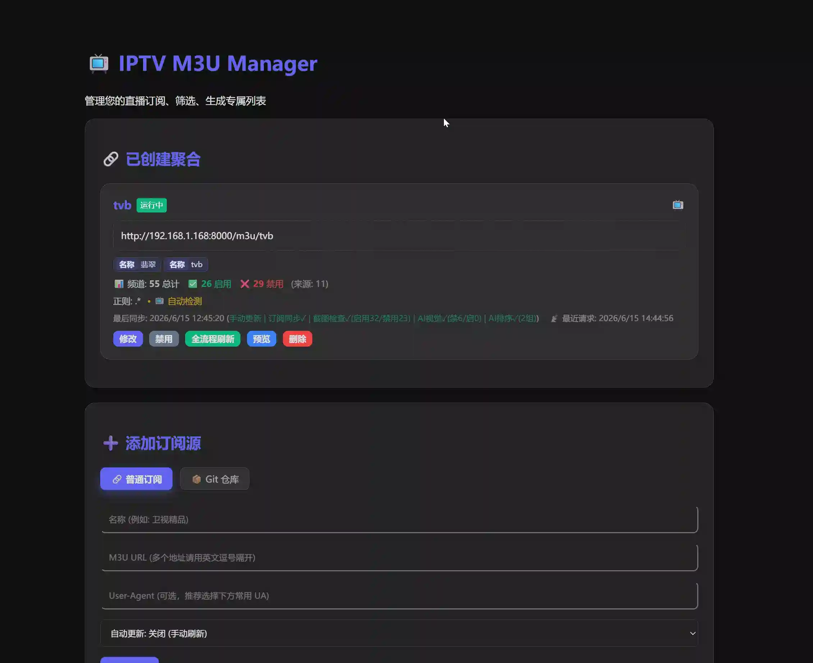
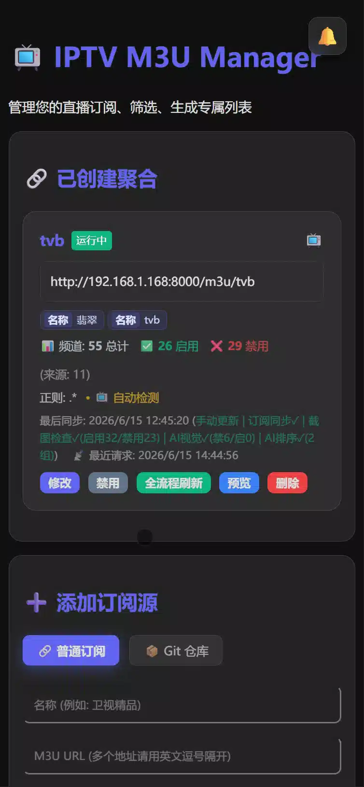
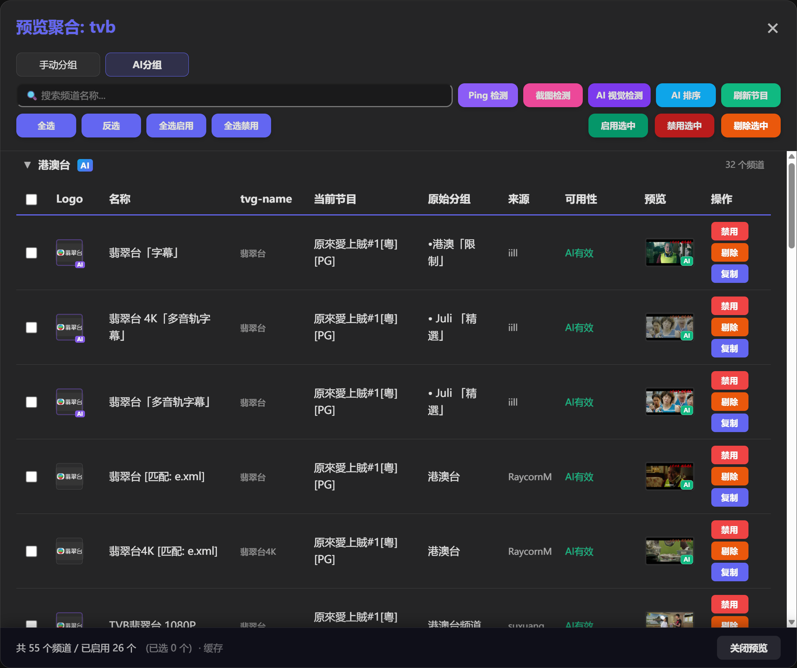

# IPTV M3U 管理器

IPTV M3U 订阅聚合与过滤工具。支持多源合并、关键字/正则筛选、自定义分组，并提供聚合预览、EPG 节目表、截图与 AI 检测等能力。

### 主要功能

- **多源聚合**：支持 M3U / TXT / GitHub 链接，多地址混排；订阅可定时自动同步。
- **精细筛选**：关键字、来源分组、正则表达式；支持排除频道与入选统计。
- **自定义分组**：将匹配频道划入自定义分组（央视、卫视等）；支持 AI 整理节目表生成分组视图。
- **聚合预览**：手动分组 / AI 分组切换、搜索过滤、批量启用禁用、从聚合表剔除/恢复；PC 表格与移动端卡片双布局。
- **EPG 与台标**：按 tvg-name 匹配节目表；同频道集群自动补齐 EPG 与 Logo（仅填空值，不覆盖已有）。
- **同频道智能覆盖**：重复频道间按 EPG、台标可达性选供体，统一 tvg-name 与台标；覆盖来源可查看（订阅源 + 供体频道名）。
- **深度检测**：FFmpeg 截图、连通性探测；支持根据结果自动启用/禁用频道。
- **AI 能力**：AI 视觉检测（可配置前置提示词）、AI 排序、AI 分组；预览图角标展示检测结果。
- **静态导出**：M3U 与预览数据落盘缓存，订阅链接 `/m3u/{slug}` 可公开访问；管理页可设密码保护。
- **任务中心**：Taskiq 异步任务，全局通知与进度展示。

### 演示截图

**PC 端聚合预览**



**移动端卡片布局**



**频道有效性 / AI 视觉检测**



### 运行指南

#### 方案一：Docker 镜像一键启动（推荐）

```bash
docker run -d \
  --name iptv-manager \
  --restart unless-stopped \
  -p 8000:8000 \
  -v $(pwd)/data:/data \
  -e TZ=Asia/Shanghai \
  ghcr.io/xianyudaxian/iptv-m3u-manager:latest
```

> **注意**：
> - Windows PowerShell 请将 `$(pwd)` 换成 `${PWD}`
> - 数据保存在当前目录 `data/` 下

#### 方案二：Docker Compose

```yaml
version: '3.8'
services:
  iptv-manager:
    image: ghcr.io/xianyudaxian/iptv-m3u-manager:latest
    container_name: iptv-manager
    restart: unless-stopped
    ports:
      - "8000:8000"
    volumes:
      - ./data:/data
    environment:
      - TZ=Asia/Shanghai
```

```bash
docker-compose up -d
```

#### 方案三：本地源码

```bash
git clone https://github.com/XianYuDaXian/iptv-m3u-manager.git
cd iptv-m3u-manager
pip install -r requirements.txt
uvicorn main:app --host 0.0.0.0 --port 8000 --reload
```

浏览器访问 `http://127.0.0.1:8000`。

### 更新日志

仅记录主要功能更新。

- **2026-06 · v1.0.15**
  - **同频道智能覆盖**：按 tvg-name 聚类，自动补齐/统一 EPG 与台标；标注覆盖来源（订阅源、供体频道名）；PC 悬停 / 移动端点击查看说明。
  - **聚合预览体验**：分组 Tab（PC 等宽 / 移动平铺）、预览快速路径与缓存先返回、启用禁用即时反馈。

- **2026-06 · v1.0.14**
  - **静态产物**：M3U 与预览 gzip 落盘，导出链接与预览接口默认可直读缓存。
  - **EPG 快照**：预览内嵌当前节目信息，支持按需刷新。
  - **AI 视觉检测**：支持用户自定义前置提示词；后端变更后预览自动刷新（移除手动「同步数据」）。

- **2026-05 · v1.0.12–v1.0.13**
  - **聚合预览缓存**与订阅多选、批量导入导出。
  - **管理页密码保护**；AI 排序自定义提示词。
  - **来源分组筛选**与聚合后处理链（异步刷新、LLM / 截图服务）。

- **2026-01**
  - **筛选增强**：排除频道、统计信息；筛选标签可编辑、拖拽排序。
  - **移动端适配**与日间/夜间主题。
  - **Taskiq 任务中心**与全局通知。
  - **深度检测**：截图、断点续传、按结果自动启停频道；聚合源定时同步与自动检测。
  - **Docker** 镜像与 Compose 部署。

- **2026-01-12**
  - 项目首发：多源聚合、关键字筛选、自定义分组、EPG/台标补全、自动更新。