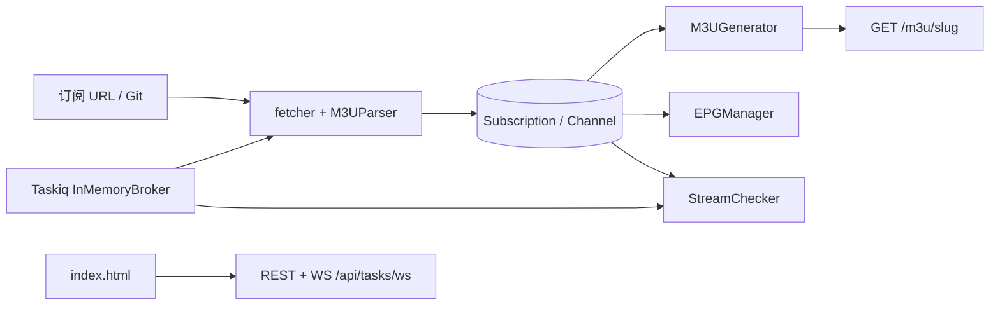

## 问题与范围

在放弃本地改动并执行 `git fetch` + `git reset --hard origin/main` + `git clean -fd` 后，重新阅读上游代码。

当前基准提交：`c4150c2 feat: 前端筛选标签可以编辑、拖拽排序`

范围：

- 入口：`main.py`、`database.py`、`task_broker.py`
- 路由：`routers/subscriptions.py`、`outputs.py`、`tools.py`、`channels.py`、`tasks.py`
- 服务：`services/fetcher.py`、`generator.py`、`stream_checker.py`、`epg.py`、`connectivity.py`
- 前端：`static/index.html`、`static/index.css`

与此前本地工作区相比，上游 **不包含** `routers/cast.py`、`android-cast-test/`、README 投屏章节等本地未提交内容。

## 速答

上游仓库是一个 **FastAPI + SQLite + 单页 HTML** 的 IPTV M3U 管理器：抓取并解析多源订阅 → 频道入库 → 按关键字/正则/排除规则聚合 → 输出 `/m3u/{slug}`，并附带 EPG 补全、FFmpeg 深度检测、Taskiq 内存任务队列与 WebSocket 任务中心。

## 关键证据

1. `main.py` 仅挂载五组路由：`subscriptions`、`outputs`、`tools`、`channels`、`tasks`，无 `/cast`。
2. `models.py` 四表：`Subscription`、`Channel`、`OutputSource`、`TaskRecord`，字段覆盖自动刷新、深度检测、聚合排除等。
3. `services/fetcher.py` 支持多 URL、Git 浅克隆扫描、M3U/TXT 解析；刷新时按频道 URL 保留启用状态与检测截图。
4. `services/generator.py` 实现关键字分组、正则过滤、`excluded_channel_ids`、台标传播与 M3U 生成。
5. `routers/outputs.py` 提供聚合 CRUD、预览、后台刷新、可选 `auto_visual_check` 挂接深度检测，以及对外 `GET /m3u/{slug}`。
6. `services/stream_checker.py` 用 FFmpeg 截帧；批量检测支持并发限制、任务中止熔断、失败频道自动 `is_enabled=False`。
7. `services/epg.py` 磁盘缓存 + 内存索引 + 简繁清洗名匹配，接口 `GET /api/epg/current`。
8. `task_broker.py` 使用 `InMemoryBroker`，重定向 stdout 到 WebSocket，任务状态更新带 canceled/failure 防回弹。
9. `static/index.html` 内含 `TagDragManager`，支持筛选标签编辑与拖拽排序（与 HEAD 提交说明一致）。
10. `README.md` 描述 Docker/本地运行与功能列表，未包含投屏网关说明。

## 细节展开

### 启动与数据

- SQLite 文件 `database.db`，`migrate_db()` 在启动时按字段探测执行 `ALTER TABLE`。
- `auto_update_task()` 每 30 秒扫描：启用且 `auto_update_minutes > 0` 的订阅与聚合源；聚合侧可触发 EPG 刷新与 `check_channels_task`。

### 订阅链路

- API：`POST/GET/PUT/DELETE /subscriptions/*`，`POST /subscriptions/{id}/refresh`
- 异步：`fetch_subscription_task.kiq(...)`
- 解析：`M3UParser` 识别 `#EXTM3U`、`#EXTINF`、TXT 分组与 `name,url` 行

### 聚合链路

- `OutputSource` 通过 JSON 字段绑定多个订阅 ID、关键字规则、排除频道 ID。
- 预览：`POST /outputs/preview`（前端防抖 `updateRealtimePreview`）
- 输出：仅启用订阅下的启用频道参与生成；可附加来源后缀与 `x-tvg-url`

### 检测与工具

- `POST /check-connectivity`：轻量 URL 探测
- `POST /check-stream-visual`：派发 `check_channels_task`
- `POST /channels/{id}/toggle`：单频道启停
- `POST /api/system/restart`：触碰 `main.py` 触发 uvicorn reload

### 任务中心

- `GET /api/tasks/`、`POST /api/tasks/{id}/stop`、`DELETE /api/tasks/cleanup`
- `WS /api/tasks/ws`：任务进度与 `console_log` 行推送

### 前端（上游最新特性）

- 关键字筛选区：`keywords` 数组、`tag_input`、标签渲染与 `activeKeyword`
- `TagDragManager`：指针/触摸拖拽、排序后写回 keywords 并触发预览更新
- 任务面板、预览浮窗、深度检测与 EPG 查询均直接调用上述 REST 接口

## 未决问题

1. 提交 `c4150c2` 的 `git show` 仅显示 `.gitignore` 变更，标签拖拽/编辑的具体代码是否已在更早提交合入，需用 `git log -p static/index.html` 进一步核对。
2. 本轮仍为静态阅读，未启动 `uvicorn` 做接口实测。
3. 仓库内保留 `database.db`、`epg_cache/`、`repo_cache/` 等运行产物，不影响架构结论但未逐项审计数据内容。

## 后续建议

若要以 CodeStable 长期维护该上游项目，建议下一步用 `cs-onboard` 或 `cs-arch` 基于本探索文档建立 `codestable/architecture/` 现状图，并把「订阅同步 / 聚合输出 / 深度检测」三条链路拆成独立需求文档。

## 相关文档

- [README.md](C:/Users/xianyu/Downloads/iptv-m3u-manager/README.md)
- [main.py](C:/Users/xianyu/Downloads/iptv-m3u-manager/main.py)
- [models.py](C:/Users/xianyu/Downloads/iptv-m3u-manager/models.py)
- [static/index.html](C:/Users/xianyu/Downloads/iptv-m3u-manager/static/index.html)
