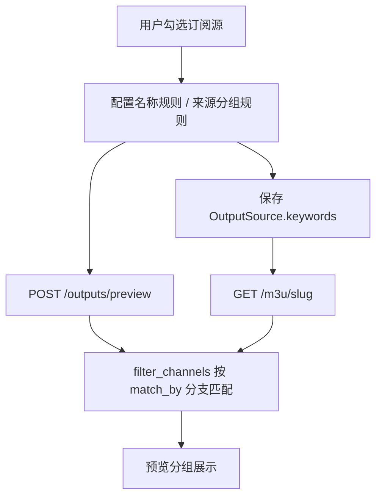

# 按来源分组筛选 — 设计方案

## 1. 背景与目标

### 现状

- 聚合规则保存在 `OutputSource.keywords`（JSON 数组），元素形如 `{ "value": "央视", "group": "卫视" }`。
- `M3UGenerator.filter_channels()` 仅用 `value` 对 **`Channel.name`** 做子串匹配（不区分大小写）。
- 字段 **`group` 在规则里的含义是「输出 M3U 时的 group-title 覆盖名」**，不是订阅源里的来源分组。
- 频道在入库时已有 **`Channel.group`**（来自 M3U `group-title` 或 TXT 分组行）。

### 目标

用户在配置聚合源时，可以**按来源分组**挑选频道（例如只收「央视频道」「香港」等源内分组），而不必只靠频道名称关键字。

### 成功标准（可验收）

1. 可为聚合源配置至少一条「按来源分组匹配」的规则，保存后重新打开编辑页规则仍在。
2. 预览与最终 `GET /m3u/{slug}` 结果一致：规则命中的频道与按名称规则命中的频道一样进入列表（仍受启用状态、排除列表、正则约束）。
3. 旧数据：仅有 `{ value, group }` 的规则行为与当前线上一致（默认仍按名称匹配）。
4. 同一条规则仍可指定输出分组（现有 `group` 覆盖逻辑不变）。

### 明确不做（v1）

- 不把正则 `filter_regex` 扩展到匹配 `Channel.group`（仍只匹配频道名）。
- 不新增数据库列；继续复用 `keywords` JSON，通过新字段区分匹配维度。
- 不做「按订阅源名称」筛选（仅 `Channel.group`）。

---

## 2. 名词层

### 2.1 筛选规则（扩展后）

每条规则仍为 JSON 对象，**向后兼容**：

| 字段 | 类型 | 默认 | 含义 |
|------|------|------|------|
| `value` | string | 必填 | 匹配子串（不区分大小写） |
| `group` | string | `""` | 命中后写入 M3U 的 `group-title`（输出分组） |
| `match_by` | `"name"` \| `"source_group"` | `"name"` | 匹配维度：频道名 vs 来源分组 |

示例：

```json
[
  { "value": "cctv", "group": "央视", "match_by": "name" },
  { "value": "香港", "group": "", "match_by": "source_group" }
]
```

### 2.2 匹配语义

- `match_by === "name"`：`value.lower() in channel.name.lower()`（与现网一致）。
- `match_by === "source_group"`：`value.lower() in (channel.group or "").lower()`；`group` 为空或 `Default` 时仍按字符串匹配（用户可搜 `default`）。

去重、排除 `excluded_channel_ids`、多规则并集逻辑与现网相同。

### 2.3 编排层（主流程）



涉及调用点（均需走同一 `filter_channels`）：

- `routers/outputs.py`：列表统计、`preview`、`get_m3u_output`、刷新后深度检测的频道集合
- `main.py`：`auto_update_task` 里聚合自动深度检测

---

## 3. 界面与交互（编排）

### 3.1 布局

在现有「关键字筛选」区域**增加并列一块**：「来源分组筛选（回车添加）」：

- 独立输入框 + 标签列表（可复用现有 `TagDragManager` 模式或轻量复制，避免与名称标签拖拽状态纠缠）。
- 写入的规则对象固定 `match_by: "source_group"`；名称区写入的规则固定 `match_by: "name"`（或省略字段）。

标签展示建议区分样式，例如前缀 `[分组]`，避免与名称标签混淆。

### 3.2 可选增强（建议做）

- 用户勾选订阅源后，请求 **`GET /outputs/source-groups?subscription_ids=1,2`** 返回去重后的 `(group, count)` 列表，点击可填入来源分组输入框（减少手打误差）。
- 若本迭代时间紧，可列为 checklist 可选步骤。

### 3.3 保存与加载

- `saveOutput()` / `updateRealtimePreview()` 提交 **`keywords` 合并数组**（名称规则 + 来源分组规则），顺序：先名称后分组或按添加顺序统一在一个数组内均可，**必须在元素上带齐 `match_by`**。
- 加载编辑聚合源时：按 `match_by` 拆回两个 UI 列表。

---

## 4. 结构健康度

| 项 | 结论 |
|----|------|
| `services/generator.py` | 仅扩展 `filter_channels` 内匹配分支，**不拆文件**（变更面小）。 |
| `static/index.html` | 已很大；新 UI 逻辑用独立函数块并注释分区，**避免再塞无关逻辑**。 |
| `routers/outputs.py` | 新增 `source-groups` 小路由可放在同文件末尾。 |

**微重构**：不做搬文件类重构，behavior 不变。

---

## 5. 流程级约束

- **兼容性**：缺省 `match_by` 视为 `name`。
- **预览与输出一致**：禁止预览走一套、M3U 走另一套过滤实现。
- **错误语义**：非法 `match_by` 值忽略该条规则或按 `name` 处理（实现时二选一并在 acceptance 写明，建议：**跳过并打日志**）。

---

## 6. 验收要点（给 acceptance 用）

1. 仅配置来源分组规则「卫视」，预览与 M3U 只含 `Channel.group` 含「卫视」的频道。
2. 名称规则与来源分组规则同时存在时，结果为两规则命中集的并集（URL 去重）。
3. 旧聚合源未改字段，导出 M3U 与升级前一致。
4. 输出分组覆盖：来源分组规则带 `group: "我的卫视"` 时，生成 M3U 中 `group-title` 为「我的卫视」。

---

## 7. 待你确认

1. **规则是否合并为一个 `keywords` 数组**（推荐，免迁移）还是新建 `group_keywords` 字段？本方案选 **合并数组 + `match_by`**。
2. **是否 v1 就做「可选分组列表」接口**？默认 **做**，工作量小、体验提升明显。

请确认本 design 后回复「按方案实现」，再进入 `cs-feat-impl`。
